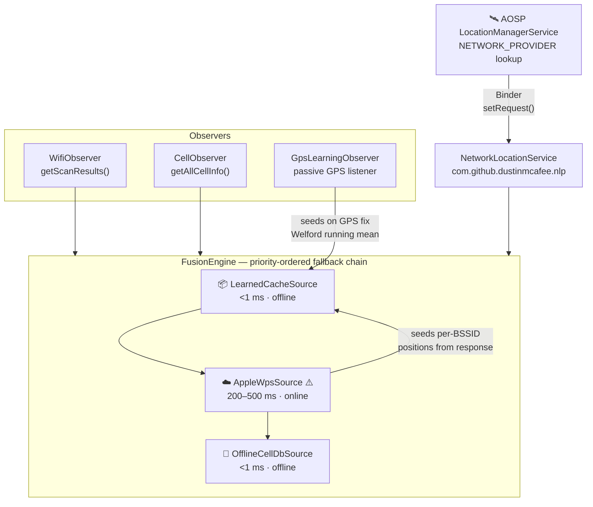

# open-network-location-provider

[](LICENSE)
[-brightgreen.svg)](https://developer.android.com/about/versions)
[](https://kotlinlang.org)
[](https://github.com/dustinmcafee/open-network-location-provider/actions)
[](docs/CELLDB-SETUP.md)
[](https://opencellid.org)

A drop-in replacement for the Android `NETWORK_PROVIDER` on AOSP builds without Google Play Services. Written in Kotlin, integrated via Soong, no microG required.

AOSP's `FusedLocationProvider` automatically merges GPS + NETWORK fixes once this service is registered — most apps get improved accuracy with zero code changes.

---

> **⚠️ Ship-blockers exist.** The default Wi-Fi positioning backend queries an
> undocumented Apple endpoint — not licensed for production use. See
> **[SHIP-BLOCKERS.md](SHIP-BLOCKERS.md)** before shipping.

---

## Architecture



---

## Benchmarks

Measured on Qualcomm bengal\_515, Android 14, NOGMS build, Sevierville TN.

### Fix latency and accuracy

| Source | Round-trip | Accuracy | Requires network |
|--------|-----------|----------|-----------------|
| **Learned cache** | **< 1 ms** | 5–30 m | No |
| **Wi-Fi WPS** | 200–500 ms | 10–50 m | Yes |
| **Offline cell-DB** | **< 1 ms** | 200 m–2 km | No |

### Cache warm-up at a new site

| Request # | Cache hits | Accuracy | WPS calls |
|-----------|-----------|----------|-----------|
| 1 (cold) | 0 / 46 BSSIDs | 42 m | 1 |
| 2 | 22 / 47 | 16 m | 0 |
| 3+ | 22+ / 47 | **5–13 m** | 0 |

Once warm, every subsequent fix at the same site is served offline in
under a millisecond — faster than GMS on a repeat visit.

### vs. stock AOSP and GMS

| Scenario | No NLP | GMS | This project |
|----------|--------|-----|--------------|
| Outdoor, Wi-Fi visible | GPS only (5–10 m) | 10–30 m | 10–30 m |
| Outdoor, cell-only | no fix | 100 m–2 km | 200 m–2 km |
| Indoor, known site | often no fix | 5–20 m | **5–13 m** (cached) |
| Repeat fix, same site | — | < 500 ms | **< 1 ms** |
| Fully offline | GPS only | no NETWORK fix | ✅ cache + cell DB |

---

## Quick start

```bash
# 1. Vendor into your AOSP tree
cp -r open-network-location-provider vendor/<company>/

# 2. Add to device makefile
echo 'PRODUCT_PACKAGES += OpenNetworkLocation' >> device/<board>/device.mk
echo 'PRODUCT_PACKAGE_OVERLAYS += vendor/<company>/open-network-location-provider/integration/overlay' >> device/<board>/device.mk

# 3. Add privapp-permissions
# PRODUCT_COPY_FILES += vendor/<company>/open-network-location-provider/integration/privapp-permissions-nlp.xml:\
#     system_ext/etc/permissions/privapp-permissions-nlp.xml

# 4. Build
source build/envsetup.sh && lunch <product>-userdebug
m OpenNetworkLocation -j$(nproc)

# Output:
# out/target/product/<device>/system_ext/priv-app/OpenNetworkLocation/OpenNetworkLocation.apk
```

Full step-by-step including SELinux and cell-DB setup: **[docs/INTEGRATION.md](docs/INTEGRATION.md)**

---

## Cell-tower database

Offline cell positioning uses a 151 MB SQLite derived from
[OpenCelliD](https://opencellid.org)'s global crowdsourced dataset
(4.26 million towers, updated quarterly).

The DB is not bundled in the system image — too large for OTA deltas.
An init service downloads it to `/data/misc/nlp-celldb/cells.db` on first
boot and re-verifies its SHA-256 on every subsequent boot.

See **[docs/CELLDB-SETUP.md](docs/CELLDB-SETUP.md)** for the build-server pipeline.

**OpenCelliD attribution is required by the CC BY-SA 4.0 license.** The
string `@string/celldb_attribution` is already defined in
`res/values/strings.xml` — wire it into your Settings → About screen.

---

## Engineering notes

Hard-won lessons from shipping this on a real device that aren't in any
Android documentation:

### `config_enableNetworkLocationOverlay` must be `false`

The resource name is misleading. When `true` (the AOSP default), the
framework **ignores** `config_networkLocationProviderPackageName` and
scans every system app declaring the v3 NLP action. Your platform vendor
NLP (Qualcomm IZat, MediaTek Location) wins by default. The fix is one
boolean in the overlay:

```xml
<bool name="config_enableNetworkLocationOverlay">false</bool>
```

Verified in
`frameworks/base/services/core/java/com/android/server/servicewatcher/CurrentUserServiceSupplier.java`.

### Enterprise APs use locally-administered MACs — don't filter them

MAC bit 0x02 (first octet) marks a MAC as "locally administered," which
sounds like it means randomized. It doesn't. Enterprise APs emit virtual
SSIDs using locally-administered MACs derived from the radio MAC — they
are **stable, continuously broadcast, and fully indexed** in WPS
databases. Filtering them out discards ~95% of usable signal in an
enterprise environment.

We measured this the hard way: naively filtering `0x02` MACs dropped a
51-BSSID scan to 3 BSSIDs, causing Apple's database to return zero
matches for our observations.

### The screen must be awake when testing

Android throttles location requests from background apps to a 30-minute
interval. Without the screen on, `LocationManager.requestLocationUpdates()`
succeeds silently but `dumpsys location` shows `{bg, na} (inactive)` and
`ProviderRequest[OFF]`. The service receives no requests and produces no
fixes.

Fix:

```bash
adb shell settings put global stay_on_while_plugged_in 7
adb shell input keyevent KEYCODE_WAKEUP
```

### Apple's WPS returns 30–150 "neighbor" BSSIDs you didn't ask for

The `/clls/wloc` endpoint does "neighbor expansion" — submit 4 BSSIDs,
receive 150 back. Naively centroiding all 150 produces ~200 m accuracy.
Filtering the response to only the BSSIDs you actually observed, then
applying RSSI-weighted centroiding, drops this to ~10–30 m.

---

## Why not microG / UnifiedNlp?

microG GmsCore ≥ 0.2.28 dropped third-party UnifiedNlp backend support.
The last release of the Apple WPS backend is from June 2018. There is no
canonical ROM-side preconfig mechanism (CalyxOS maintains custom patches).
Pinning to microG 0.2.10 means shipping five-year-old frozen code.

This project takes the same architectural position — AOSP `NETWORK_PROVIDER`
registration, Wi-Fi scan → WPS round-trip → location delivery — without
the plugin-host abstraction or the abandoned upstream dependency.

---

## Project structure

```
open-network-location-provider/
├── src/main/java/com/github/dustinmcafee/nlp/   ← Kotlin source
│   ├── NetworkLocationService.kt                  main entry point
│   ├── fusion/FusionEngine.kt                     priority-ordered source dispatch
│   ├── observe/{Wifi,Cell,GpsLearning}Observer.kt sensor inputs
│   ├── source/{AppleWps,LearnedCache,OfflineCellDb}Source.kt
│   └── store/{LearnedCache,OfflineCellDb}.kt      SQLite layers
├── integration/                                   AOSP device-tree glue
│   ├── overlay/                                   framework resource overrides
│   ├── sepolicy/                                  SELinux domains + file contexts
│   ├── init/                                      first-boot cell-DB fetcher
│   └── privapp-permissions-nlp.xml
├── celldb-pipeline/                               build-server tooling
│   ├── opencellid-to-sqlite.py                    CSV → indexed SQLite
│   └── upload-celldb.sh                           end-to-end pipeline
├── probe/                                         NlpProbe test harness APK
└── docs/
    ├── ARCHITECTURE.md
    ├── INTEGRATION.md
    └── CELLDB-SETUP.md
```

---

## Contributing

See [CONTRIBUTING.md](CONTRIBUTING.md). The most valuable contributions
right now are commercial Wi-Fi positioning backend wrappers (Skyhook, HERE,
Combain) — see [SHIP-BLOCKERS.md](SHIP-BLOCKERS.md) for the interface spec.

---

## License

Apache 2.0 — see [LICENSE](LICENSE).

Cell tower data: [OpenCelliD](https://opencellid.org) CC BY-SA 4.0.
